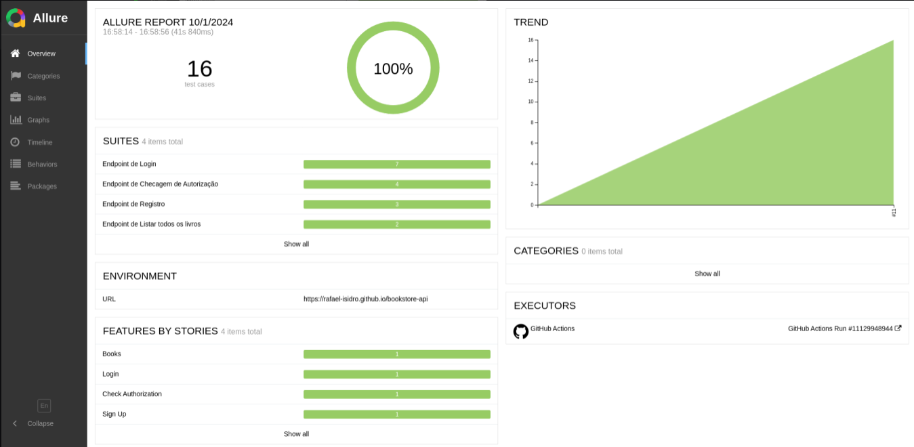
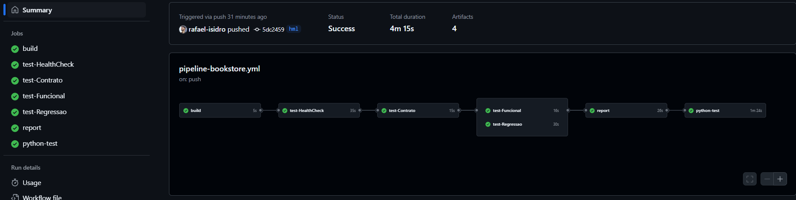
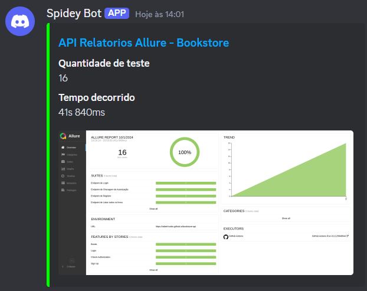

# BookStore API - Testes RestAssured

Este projeto é uma suíte de testes automatizados para a API **[BookStore](https://bookstore.toolsqa.com/swagger/)** usando o framework **Rest Assured**. Ele inclui relatórios gerados pelo **Allure Reports**, integração contínua com **GitHub Actions**, e envio de relatórios de execução para um canal do **Discord**.

## Tecnologias Utilizadas

- **Rest Assured**: Para automação de testes de APIs RESTful.
- **JUnit**: Framework de testes utilizado para organizar e executar os testes.
- **Lombok**: Para reduzir o código boilerplate nas classes Java.
- **Allure Reports**: Geração de relatórios detalhados dos testes.
- **GitHub Actions**: Para configurar a pipeline de CI/CD.
- **Discord**: Integração para envio de relatórios de execução para um canal específico.

## Sobre o Projeto

- Testes automatizados para alguns dos endpoints da API BookStore.
- Geração de relatórios detalhados com gráficos, histórico de testes e falhas.
- Integração contínua com execução de testes automatizados a cada commit ou pull request.
- Notificações automáticas no Discord com os resultados dos testes.

**Obs.:** Necessário um usuário de testes cadastrado no sistema e adicionado a um arquivo resources -> application-config.properties para execução bem sucedida dos testes em repositório local ou com credenciais adicionadas às secrets do repositório para execução da pipeline.

## Estrutura do Projeto

A estrutura do projeto está organizada da seguinte forma:

```plaintext
.github
├── workflows
│   └── pipeline-bookstore.yml
scripts
│   ├── allure-report.py
│   └──requirements.txt
src
├── main
│   ├── java
│   │    ├── client
│   │    │   ├── BaseClient
│   │    │   ├── BookClient
│   │    │   ├── CheckAuthorizationClient
│   │    │   ├── LoginClient
│   │    │   └── SignupClient
│   │    ├── data
│   │    │   └── factory
│   │    │       ├── LoginDataFactory
│   │    │       └── SignupDataFactory
│   │    ├── exception
│   │    │   └── PropertiesLoadingException
│   │    ├── models
│   │    │   ├── response
│   │    │   │   ├── BookResponseModel
│   │    │   │   ├── ResponseModel
│   │    │   │   └── SignupResponseModel
│   │    │   └── request
│   │    │       ├── LoginRequestModel
│   │    │       └── SignupRequestModel
│   │    ├── story
│   │    │   ├── BookStory
│   │    │   ├── CheckAuthorizationStory
│   │    │   ├── LoginStory
│   │    │   └── SignupStory
│   │    └── utils
│   │        ├── Auth
│   │        ├── Manipulation
│   │        └── TestListener
│   └── resources
│       ├── application-config.properties
│       └── log4j.properties
└── test
    ├── java
    │   └── org
    │       └── org.restassured
    │           └── org.restassured.bookstore
    │               └── test
    │                   ├── BookTest
    │                   ├── CheckAuthorizationTest
    │                   ├── LoginTest
    │                   └── SignupTest
    └── resources
        └── schemas
            ├── book-get.json
            └── login-post.json
.gitignore
pom.xml
README.md
```

## Integração com GitHub Actions

O projeto já vem configurado com um pipeline de CI/CD no GitHub Actions. Toda vez que um commit for enviado ou um pull request for criado, a pipeline será automaticamente disparada, executando os testes e gerando relatórios como abaixo:


O arquivo de pipeline (`.github/workflows/pipeline-bookstore.yml`) está configurado para:

- Executar os testes automatizados.
- Publicar os relatórios gerados pelo Allure.
- Enviar uma notificação para o canal do Discord com o status da execução dos testes.



## Configuração do Discord

Para configurar o envio de relatórios para o Discord, foi utilizada uma webhook do Discord. Siga os passos abaixo para ajustar o envio para o seu canal:

1. Crie uma webhook no canal do Discord desejado.
2. Adicione a URL da webhook como um secret no repositório GitHub (`Settings -> Secrets -> Actions`), com o nome `DISCORD_WEBHOOK_URL`.
3. A pipeline do GitHub Actions já está configurada para usar essa URL e enviar as notificações automaticamente.



---
## Autor

<a href="https://github.com/rafael-isidro">
    
    <br />
    <sub><b>Rafael Santos Isidro</b></sub>
</a> 
<br />